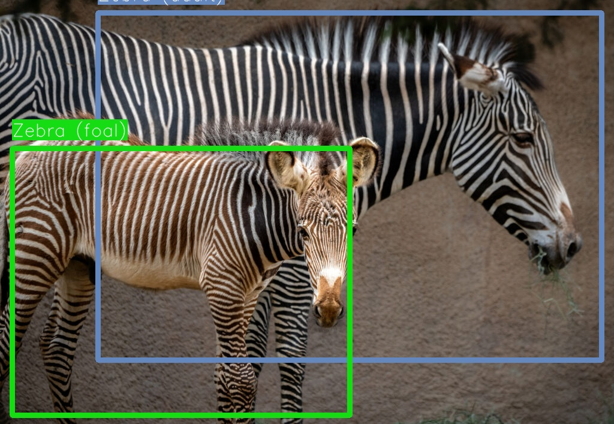
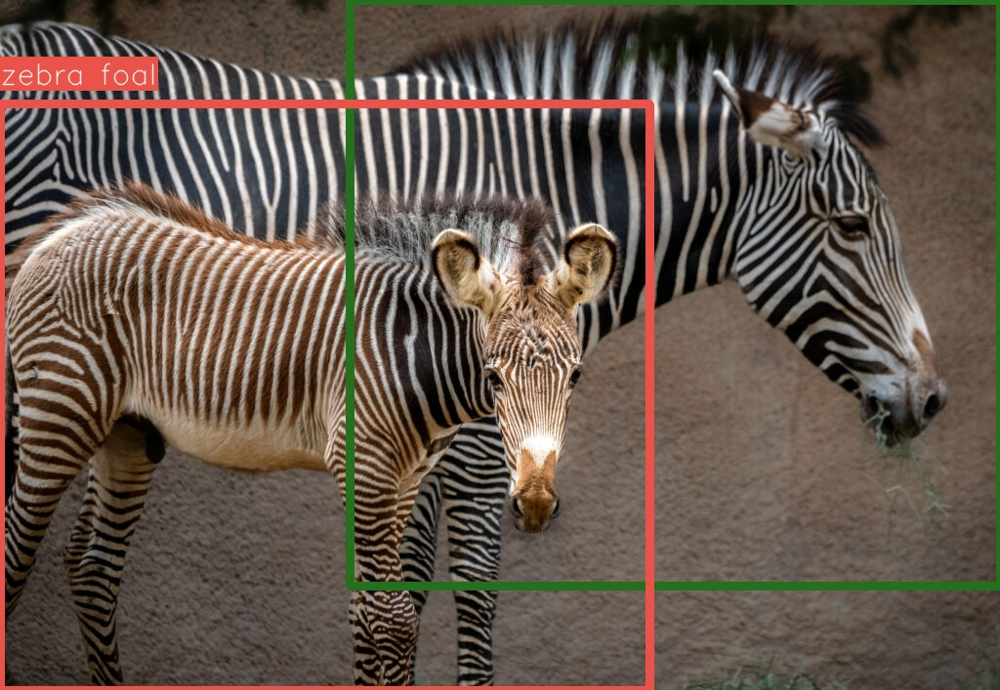

# LLMBBOX
Inspired from the [cookbook](https://docs.x.ai/cookbook/examples/multimodal/object_detection) from [Omar Diab](https://github.com/Omar-V2) using Grok, this repo explores creating bounding boxes leveraging multimodal LLMs. Implemented in this class are Anthropic and OpenAI clients.


# How 2 Use
First, copy the `.env.sample` -> `.env` and set both API keys.

Then to configure an environment:
```sh
conda create -n 'llmbbox' python=3.11 -y
conda activate llmbbox
pip install -r requirements.txt
python main.py
```

# Examples of BBoxes Created
## Input Image


## GPT Created Bounding Boxes


## Claude Created Bounding Boxes



# Tweaking
To adjust the instructions being set, the prompts live at `domain/prompts.py`. Also when calling the object detection method
```python
results_openai, output_path = detector.detect_objects(
    image_path="./imgs/input/two_zebras.jpg",
    user_prompt="Find all animals in this image",
    provider=ModelProvider.OPENAI,
    output_path="./imgs/output/openai_bbox.jpg"
)
```
A `user_prompt` field can be set to make smaller adjustments (think what to target with the bbox creation).

# Results Analysis
As an initial implementation, it works fairly well. Some cases these models struggle more than Grok did in the example cookbook. Echoing what [Omar said](https://docs.x.ai/cookbook/examples/multimodal/object_detection#conclusion), results can vary heavily between runs. Lowering the temperature + adding stronger rules around bbox creation in the prompt may lead to better results.